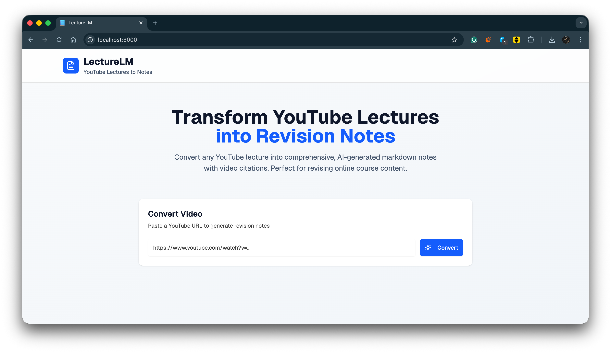

# LectureLM

LectureLM helps students and lifelong learners create comprehensive revision notes from YouTube lectures. It automatically generates structured notes that summarize key concepts, making revision faster and more effective.

**Unique Selling Point:**
LectureLM links specific sections of the notes directly to corresponding timestamps in the YouTube video. Instantly jump to the exact part of the lecture for quick review or clarification while revising.

---

## Features
- Generates detailed revision notes from YouTube lecture videos
- Structured notes for easy reading and quick revision
- Embedded direct links to video timestamps for instant look-up
- Modern, responsive UI
- Easy to customize

---


# LectureLM

LectureLM helps students and lifelong learners create comprehensive revision notes from YouTube lectures. It automatically generates structured notes that summarize key concepts, making revision faster and more effective.

**Unique Selling Point:**
LectureLM links specific sections of the notes directly to corresponding timestamps in the YouTube video. Instantly jump to the exact part of the lecture for quick review or clarification while revising.

---

## Screenshot
Add a screenshot below to showcase the app interface or sample notes. Example:



---

## Demo Video
Watch a demo of LectureLM in action:

[](https://youtu.be/x277HmhkL3o)

---

## Features
...existing code...

## Installation
...existing code...

## Getting Started (Frontend)
...existing code...

## Contributing
...existing code...

## License
See the `LICENSE` file for details.
   pnpm start
   ```

---

## Contributing
Pull requests are welcome. For major changes, please open an issue first to discuss your ideas.

---

## License
See the `LICENSE` file for details.
